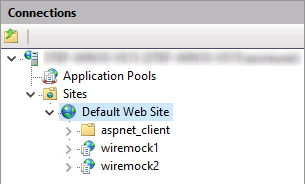
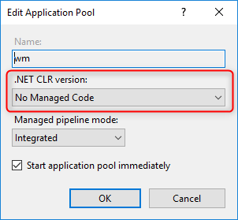

# Running in IIS

Follow these links / steps:
* https://weblog.west-wind.com/posts/2016/Jun/06/Publishing-and-Running-ASPNET-Core-Applications-with-IIS
* Create a `web.config` file

## IIS Sites
Sites configuration looks like:

## App Pool settings

## Publish Profiles
Two example publish profiles are created:
* [IIS Localhost 1](./Properties/PublishProfiles/ISS%20Localhost%201.pubxml)
* [IIS Localhost 2](./Properties/PublishProfiles/ISS%20Localhost%202.pubxml)