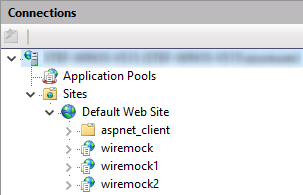
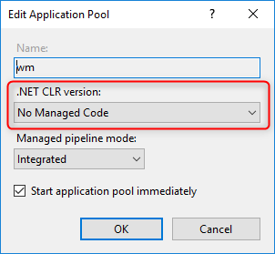
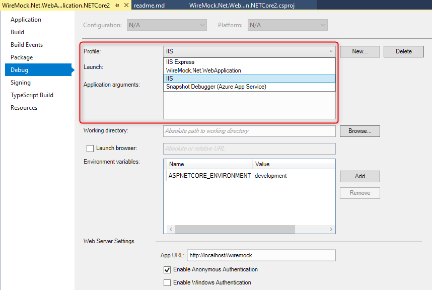

# Running in IIS

Follow these links / steps:
* https://weblog.west-wind.com/posts/2016/Jun/06/Publishing-and-Running-ASPNET-Core-Applications-with-IIS
* https://docs.microsoft.com/en-us/aspnet/core/host-and-deploy/iis/development-time-iis-support?view=aspnetcore-2.1
* Create a `web.config` file

## IIS Sites

## App Pool settings

## Publish Profiles
Two example publish profiles are created:
* [IIS Localhost 1](./Properties/PublishProfiles/IIS%20Localhost%201.pubxml)
* [IIS Localhost 2](./Properties/PublishProfiles/IIS%20Localhost%202.pubxml)

## Debugging
Select the debug "IIS" if you want to debug in IIS.

