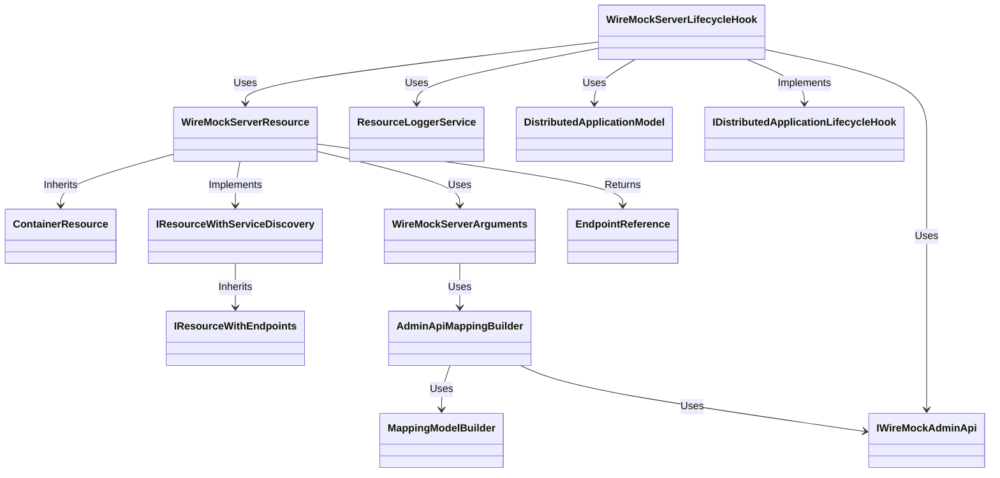

overview

```mermaid
classDiagram
    class WireMockServerResource {
    }

    class ContainerResource {
    }

    class IResourceWithServiceDiscovery {
    }

    class IResourceWithEndpoints {
    }

    class WireMockServerArguments {
    }

    class EndpointReference {
    }

    class AdminApiMappingBuilder {
    }

    class IWireMockAdminApi {
    }

    class MappingModelBuilder {
    }

    class WireMockServerLifecycleHook {
    }

    class ResourceLoggerService {
    }

    class DistributedApplicationModel {
    }

    class IDistributedApplicationLifecycleHook {
    }

    WireMockServerResource --> ContainerResource : Inherits
    WireMockServerResource --> IResourceWithServiceDiscovery : Implements
    WireMockServerResource --> WireMockServerArguments : Uses
    WireMockServerResource --> EndpointReference : Returns
    WireMockServerArguments --> AdminApiMappingBuilder : Uses
    AdminApiMappingBuilder --> MappingModelBuilder : Uses
    AdminApiMappingBuilder --> IWireMockAdminApi : Uses
    
    IResourceWithServiceDiscovery --> IResourceWithEndpoints : Inherits
    WireMockServerLifecycleHook --> IDistributedApplicationLifecycleHook : Implements
    WireMockServerLifecycleHook --> ResourceLoggerService : Uses
    WireMockServerLifecycleHook --> DistributedApplicationModel : Uses
    WireMockServerLifecycleHook --> WireMockServerResource : Uses
    WireMockServerLifecycleHook --> IWireMockAdminApi : Uses
    

```